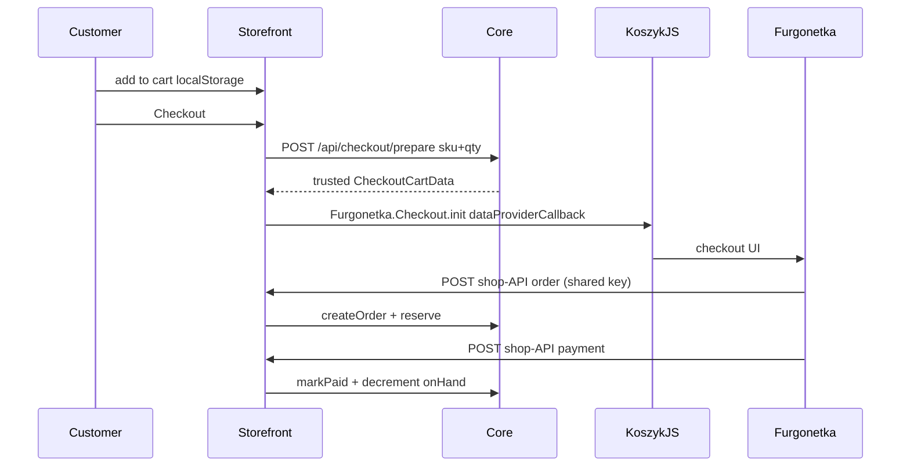
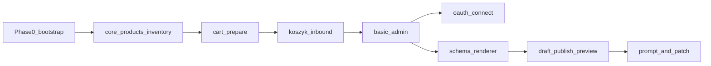

# LiteShop MVP Implementation Plan

> **For agentic workers:** REQUIRED SUB-SKILL: Use superpowers:subagent-driven-development (recommended) or superpowers:executing-plans to implement this plan task-by-task. Execute **one phase plan at a time** in this order. Do not start the next phase until that phase's gate passes.
>
> Źródło: [docs/prd.md](../../prd.md).
>
> Szczegółowe plany TDD:
>
> 1. [2026-08-24-liteshop-phase-0-bootstrap.md](./2026-08-24-liteshop-phase-0-bootstrap.md)
> 2. [2026-08-24-liteshop-phase-1-commerce-proof.md](./2026-08-24-liteshop-phase-1-commerce-proof.md)
> 3. [2026-08-24-liteshop-phase-2-store-definition.md](./2026-08-24-liteshop-phase-2-store-definition.md)
> 4. [2026-08-24-liteshop-phase-3-ai-generation.md](./2026-08-24-liteshop-phase-3-ai-generation.md)

**Goal:** Merchant sprzedaje przez działający sklep (katalog, stock, Koszyk) zanim pojawi się generator. Store Definition (Phase 2) zmienia wygląd bez AI. LLM (Phase 3) tylko projektuje prezentację — bez budowania checkoutu, płatności ani fulfillmentu.

**Architecture:** `@liteshop/core` jest jedynym miejscem logiki produktów, stocku i lustra zamówień. `@liteshop/furgonetka` izoluje Koszyk/OAuth. Renderer jest deterministyczny: ten sam definition → ten sam HTML. LLM (dopiero Phase 3) produkuje wyłącznie `StoreDefinition`.

**Tech Stack:** TypeScript strict, pnpm workspaces, Astro 5 (SSR + islands), React islands, Tailwind + shadcn, SST v3 (`sst.aws.Astro` / Dynamo / Bucket / Cron / Secret), DynamoDB single-table, S3, Vitest, Zod.

## Global Constraints

Skopiowane z PRD — obowiązują każde zadanie:

- LLM nigdy nie generuje stock/payment/auth/DynamoDB/inbound-handler/IAM/checkout code — tylko `StoreDefinition` i copy produktowe.
- LiteShop jest SoT inventory; Furgonetka jest SoT checkout/payments/shipping/invoices.
- `available` się nie zapisuje: `available = onHand - reserved`.
- Ceny w groszach (`integer`), nigdy float.
- Cart w `localStorage` jest niewiarygodny (tylko `sku` + `quantity`).
- Callbacki `ORDER_CREATED` / `PAYMENT_PAID` / `SHIPPING_CHANGED` idempotentne.
- Sesja LiteShop: własne cookie HttpOnly / Secure / SameSite — nie token Furgonetki.
- MVP: jeden storefront, jeden magazyn, jedno połączenie Furgonetka, PLN / pl-PL, proste produkty.
- Brak: custom checkout, płatności, kurierzy, KSeF, ERP, Redis, K8s, ECS.

**Poza tym planem:** Phase 4 (Operational AI), wszystko z PRD §5 Non-goals.

**Wymagania operatora (nie kod):** konto AWS, Furgonetka sandbox, zarejestrowana aplikacja OAuth (dopiero przy admin connect), custom integration Koszyk z base URL + shared key.

---

## Tasks

- [ ] Phase 0 — [bootstrap](./2026-08-24-liteshop-phase-0-bootstrap.md)
- [ ] Phase 1 — [commerce proof](./2026-08-24-liteshop-phase-1-commerce-proof.md)
- [ ] Phase 2 — [store definition](./2026-08-24-liteshop-phase-2-store-definition.md)
- [ ] Phase 3 — [AI generation](./2026-08-24-liteshop-phase-3-ai-generation.md)

---

## Stan repo i układ plików

Repo jest puste poza dokumentacją (`docs/prd.md`, `docs/CONTEXT.md`, `docs/adr/`, plany). Od dnia 1:

```text
apps/web/                         # Astro: storefront + admin + API routes
packages/core/                    # @liteshop/core — commerce domain
packages/furgonetka/              # @liteshop/furgonetka — jedyna wiedza o Furgonetce
packages/schema/                  # @liteshop/schema — Phase 2
packages/renderer/                # @liteshop/renderer — Phase 2
packages/ui/                      # @liteshop/ui — shadcn islands
sst.config.ts
pnpm-workspace.yaml
docs/adr/0001-dynamodb-single-table.md
docs/CONTEXT.md                   # glossary, bez implementacji
```

Każdy pakiet domainowy: porty (interfaces) + adaptery. Testy jednostkowe idą na in-memory port; AWS SDK nie w testach core.

---

## Furgonetka Koszyk — model, nie zgadywać URL-i

Koszyk **nie** jest redirectem do obcego checkoutu. Działa odwrotnie:



Pierwszy task Furgonetki to **contract capture**: typy z docs (`CheckoutInitConfiguration`, `CheckoutCartData`) + nagrane fixture request/response inbound API. Nie wymyślamy pathy endpointów — bierzemy je z [dokumentacji Koszyk](https://furgonetka.pl/api/koszyk) i wkładamy do `packages/furgonetka`.

OAuth ([docs](https://furgonetka.pl/api/oauth)) jest osobnym torem: admin login + „Otwórz w Furgonetce”. Nie blokuje pierwszego płatnego zamówienia — Phase 1 startuje na operator-configured shared key w SST Secret.

---

## DynamoDB (ADR-001 w kodzie)

Jedna tabela, `shopId` na każdym kluczu od dnia 1, jeden seedowany shop.

- `SHOP#{shopId} / META`
- `SHOP#{shopId} / PRODUCT#{productId}` (+ GSI `slug`)
- `SHOP#{shopId} / INVENTORY#{sku}`
- `SHOP#{shopId} / INVEVT#{ulid}`
- `SHOP#{shopId} / ORDER#{orderId}`
- `SHOP#{shopId} / EXTORDER#{externalOrderId}` (idempotency)
- `SHOP#{shopId} / RESERVATION#{orderId}` (`expiresAt`, GSI do Cron)
- `SHOP#{shopId} / FURGONETKA`
- `SESSION#{id} / META`
- później: `STORE#DRAFT`, `STORE#VERSION#{n}`

Rezerwacja: TransactWrite `ORDER` + `INVENTORY` z warunkiem `onHand - reserved >= qty`. Paid: `onHand -= qty`, `reserved -= qty`, warunek `paymentStatus <> PAID`. Duplikat callback = no-op.

---

## Phase 0 — bootstrap (1–2 dni)

- pnpm workspace, TypeScript project refs, Vitest, Prettier, `sst.config.ts` z `sst.aws.Astro` (SSR), Dynamo, Bucket (product images), Cron (reservation expiry), Secrets.
- Astro app w `apps/web` z health page.
- `docs/CONTEXT.md` (Shop, Product, Inventory, Reservation, OrderMirror, StoreDefinition, Draft/Published).
- ADR: single-table DynamoDB + money-in-grosze + Koszyk-inbound.

Szczegóły: [phase-0-bootstrap](./2026-08-24-liteshop-phase-0-bootstrap.md).

**Done when:** `pnpm test` + `sst dev` serwuje Astro.

---

## Phase 1 — Commerce proof

Sukces PRD: *A real product can be bought end-to-end.* Hardcoded storefront, zero AI, zero StoreDefinition.

### 1.1 `@liteshop/core` — produkty

- Model: `id, sku, slug, name, description, images, price (grosze), status, metadata`.
- Port `ProductRepository`. In-memory + Dynamo adapter.
- Admin API: CRUD. Storefront: list active + PDP by slug.
- Testy: unique sku/slug per shop, inactive produkt nie idzie do storefrontu.

### 1.2 Inventory

- `{ sku, onHand, reserved }`. Eventy: `DELIVERY | ADJUSTMENT | RESERVATION | SALE | RESERVATION_RELEASED`.
- `reserve(sku, qty)` tylko gdy `onHand - reserved >= qty` (conditional write).
- `confirmSale` (paid) i `release` (expiry/fail) idempotentne per `orderId`.
- Admin: stany + dostawa + korekta + historia.
- Testy concurrency: dwa równoległe reserve na ostatnią sztukę — jeden fail.

### 1.3 Cart + checkout prepare

- Island: localStorage `{ items: [{ sku, quantity }] }`.
- `POST /api/checkout/prepare` przyjmuje tylko sku+qty; serwer dokłada cenę, nazwę, availability.
- Brak stocku / inactive → 409, bez mutacji inventory.
- Odpowiedź mapowana przez `@liteshop/furgonetka` na `CheckoutCartData`.

### 1.4 Furgonetka adapter + inbound API

- Verify shared key na każdym inbound request.
- `createOrderFromKoszyk`: dedupe po `externalOrderId`, tworzy OrderMirror `CREATED/PENDING`, reserve.
- `applyPaymentStatus`: mapuj statusy providerowe **tylko** w adapterze → `PENDING | PAID | FAILED | CANCELLED`. PAID → confirmSale.
- Storefront ładuje `universal-checkout-sandbox.js` i `Furgonetka.Checkout.init`.
- Furgonetka down → retriable error, zero mutacji inventory jeśli order nie powstał.

### 1.5 Reservation TTL

- Default ~20 min, konfiguracja per shop.
- `sst.aws.Cron` zwalnia expired reservations.
- Test: expired reservation zwiększa available, nie zmienia onHand.

### 1.6 Storefront + basic admin

- Public: home (hardcoded), listing, PDP, cart, checkout button.
- Admin (na razie env password cookie — OAuth w 1.8): Dashboard (liczniki + niski stan), Orders list/detail, Products, Inventory.
- Order detail: payment/shipping + `[ Otwórz w Furgonetce ]` (URL z adaptera; w 1.6 może być placeholder).

### 1.7 Observability

Structured logs: `shopId, orderId, externalOrderId, sku, operation, correlationId`. Nigdy tokenów/sekretów.

### 1.8 Connect Furgonetka + admin OAuth (koniec Phase 1)

- „Połącz Furgonetkę”: OAuth authorization_code, szyfrowany refresh token (KMS), status połączenia.
- `/admin` → Sign in with Furgonetka → LiteShop session cookie. Token Furgonetki nie wychodzi do browsera.
- To jest ostatni slice Phase 1, po pierwszym sandbox purchase na operator secret.

Szczegóły: [phase-1-commerce-proof](./2026-08-24-liteshop-phase-1-commerce-proof.md).

**Phase 1 done when:** sandbox: produkt → koszyk → Koszyk → płatność testowa → order `PAID` w adminie, inventory `onHand` spadł raz, drugi identyczny payment callback nic nie robi.

---

## Phase 2 — Store Definition

Sukces: *Multiple visually different stores entirely from Store Definition.* Nadal bez AI.

- `@liteshop/schema`: Zod `StoreDefinition` v1 (store/theme/pages/sections). Unknown `type` → fail.
- Registry z PRD §12: Hero, Product Grid, Featured Product, Split Story, Text, Image, Gallery, Testimonials, FAQ, Newsletter, Logo Cloud, Spacer.
- `@liteshop/renderer`: definition → przetestowane komponenty Astro. Ten sam JSON = ten sam markup.
- Draft vs Published + min. 10 published versions + rollback.
- Preview: `{origin}/preview` (sesja admina, [ADR-004](../../adr/0004-preview-renders-draft.md)) renderuje **draft**. Publish: validate → swap pointer → cache invalidation. Publish fail zostawia poprzednią published.
- Store settings: name, domain, locale, currency, Furgonetka status, publish status.
- Custom domain na `sst.aws.Astro` / Router — tu, nie w Phase 1.

Szczegóły: [phase-2-store-definition](./2026-08-24-liteshop-phase-2-store-definition.md).

Phase 1 hardcoded pages zastąpić rendererem; commerce API bez zmian.

---

## Phase 3 — AI storefront generation

Sukces: *Non-technical merchant creates a credible storefront without editing YAML.*

Pipeline: prompt → intent → structured `StoreDefinition` → schema + business validation → draft → preview. Invalid LLM output **nie** idzie do renderera; poprzedni draft zostaje.

- AI edit: `current definition + instruction → structured patch` (nie full regen).
- AI Designer w adminie (PRD §39).
- LLM copy helper na produkcie: description / SEO / alt. **Zakazane:** SKU, stock, tax, price, wymiary, waga.
- Provider za interfejsem (Bedrock), zero wiedzy o `@liteshop/core` inventory/orders.

Szczegóły: [phase-3-ai-generation](./2026-08-24-liteshop-phase-3-ai-generation.md).

**MVP acceptance (PRD §49) zamyka się tu:** generate → preview → AI edit → 10 produktów ze zdjęciami/cenami/stockiem → Furgonetka → domain → real order → inventory poprawne → rollback definition.

---

## Kolejność i zależności



Nie zaczynać Phase 2 zanim Phase 1 nie ma płatnego sandbox ordera. Nie zaczynać Phase 3 zanim renderer nie ma testów na cały registry.

---

## Weryfikacja

- Domain: Vitest w `packages/core` (reserve/oversell/idempotent paid/expiry).
- Adapter: contract tests na fixture Koszyk (auth fail, dup order, dup paid).
- UI: browser — listing → PDP → cart → checkout button; admin order+stock. Phase 2: dwa różne definition, ten sam renderer. Phase 3: prompt → preview → drugi prompt patchuje draft, nie published.
- E2E sandbox Furgonetka jest bramką Phase 1 — bez niego Phase 1 nie jest „done”.
